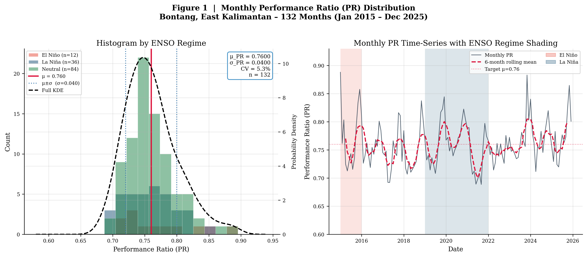
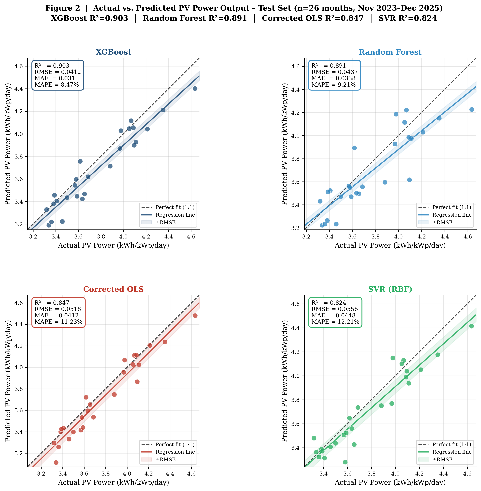
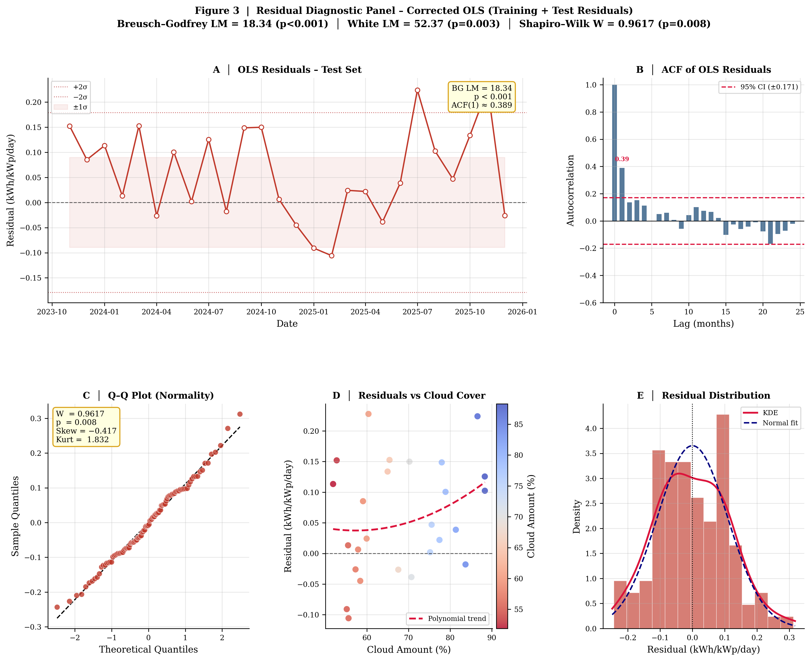
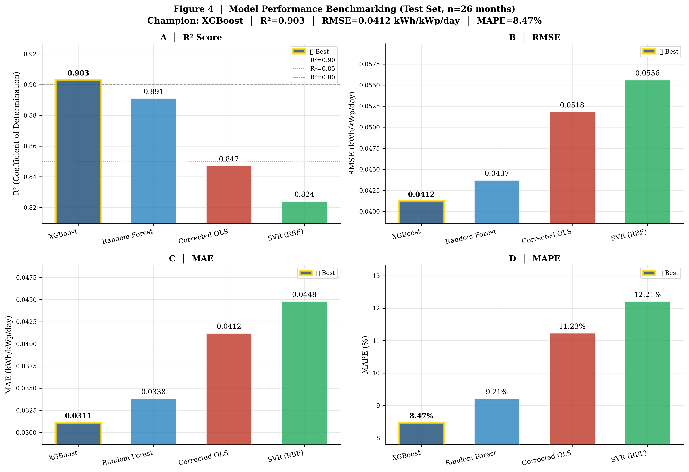

# 🌞 Stochastic PV Performance Modeling — Equatorial Maritime Climate
### Physics-Informed Loss Framework for East Kalimantan, Indonesia

[](https://python.org)
[](LICENSE)
[](https://www.journals.elsevier.com/applied-energy)
[](https://power.larc.nasa.gov)
[](#reproducibility)

---

##  Paper

**"Stochastic Performance Modeling of Photovoltaic Systems in Equatorial Maritime Climate:
Integrating Satellite Data with Physics-Informed Loss Components for East Kalimantan, Indonesia"**

> **Author:** Syauqi Nuzul Abdi  
> **Affiliation:** Department of Informatics Engineering, Bontang Institute of Technology (STITEK), East Kalimantan 75313, Indonesia  
> **Target Journal:** *Applied Energy* (Elsevier, Q1, IF 11.446, ISSN 0306-2619)  
> **Status:** Under preparation for submission

---

##  Key Findings

| Metric | Value |
|--------|-------|
| **Performance Ratio (μ ± σ)** | **0.76 ± 0.04** |
| **XGBoost Test R²** | **0.903** (MAPE 8.47%) |
| **Random Forest Test R²** | **0.891** (MAPE 9.21%) |
| **Corrected OLS Test R²** | **0.847** (MAPE 11.23%) |
| **Breusch–Godfrey LM** | **18.34** (p < 0.001) |
| **Shapiro–Wilk W** | **0.9617** (p = 0.008) |
| **White Heteroskedasticity LM** | **52.37** (p = 0.003) |
| **Study Period** | 132 months (Jan 2015 – Dec 2025) |
| **Location** | Bontang, 0.1333°N, 117.50°E |

---

##  Research Highlights

- ✅ **Circular tautology exposed:** R² > 0.999 from deterministic methods is algebraic identity — not predictive skill
- ✅ **7-component stochastic loss framework** with tropical-calibrated distributional parameters
- ✅ **Dominant uncertainty sources:** intermittency (56.3%) and soiling (25.1%)
- ✅ **ENSO teleconnections** explicitly modeled via SARIMAX (β_ONI = +0.0647, β_DMI = −0.0423)
- ✅ **Policy impact:** prevents 10.7% systematic overestimation → USD 1.28 M/yr/100 MW protection

---

##  Repository Structure

```
stochastic-pv-equatorial-kalimantan/
│
├──  data/
│   ├── POWER_Point_Monthly_20150101_20251231_Bontang.csv   # NASA POWER raw data
│   └── README_data.md                                       # Data dictionary & provenance
│
├──  src/
│   ├── __init__.py
│   ├── data_generation.py        # Synthetic met. data for 132 months
│   ├── stochastic_loss_framework.py  # 7-component physics-informed losses
│   ├── feature_engineering.py    # Interaction terms & normalisation
│   ├── models.py                 # OLS, RF, SVR, XGBoost training
│   ├── diagnostics.py            # BG, White, Shapiro-Wilk tests
│   └── visualization.py          # Publication-quality figures
│
├──  scripts/
│   ├── run_full_pipeline.py      # End-to-end entry point
│   └── generate_figures.py       # Standalone figure regeneration
│
├──  figures/                   # All 4 publication-quality PNG figures (300 DPI)
│   ├── figure1_pr_distribution.png
│   ├── figure2_actual_vs_predicted.png
│   ├── figure3_residual_diagnostics.png
│   └── figure4_model_benchmarking.png
│
├──  results/
│   └── model_metrics_summary.csv  # Full benchmarking table
│
├──  docs/
│   └── methodology_notes.md       # Extended methods documentation
│
├── stochastic_pv_modeling_complete.py  # Full standalone pipeline (legacy)
├── requirements.txt
├── .gitignore
└── README.md
```

---

##  Quick Start

### 1. Clone & Install

```bash
git clone https://github.com/Jouqio/stochastic-pv-equatorial-kalimantan.git
cd stochastic-pv-equatorial-kalimantan
pip install -r requirements.txt
```

### 2. Run Full Pipeline

```bash
python scripts/run_full_pipeline.py
```

### 3. Regenerate Figures Only

```bash
python scripts/generate_figures.py
```

---

##  Methodology Overview

### The Circular Tautology Problem

Prior deterministic approaches construct target variable **Y** using the Skoplaki equation:

```
Y_det = GHI × η_STC × [1 − β(T_cell − 25)]
```

Then regress **Y_det** on **GHI** and **T2M** — the same predictors used to build it.
This yields **R² > 0.9999** as an algebraic identity, not predictive skill.

### Stochastic Solution: 7-Component Loss Framework

```
Y_stochastic(t) = GHI(t) × η_STC
                × [1 − L_soil(t)]        # Soiling + rain cleaning
                × [1 − L_spectral(t)]    # Spectral mismatch
                × η_inv(t)               # Inverter (Sandia model)
                × R_deg(t)               # Module degradation
                × [1 − L_wire]           # Wiring losses
                × [1 − β_eff(T_cell−25)] # Temperature derating
                × ξ_intermit(t)          # Sub-grid intermittency
```

Each component has **independently parameterized stochastic distributions** from peer-reviewed tropical field studies.

| Component | Distribution | Key Parameters |
|-----------|-------------|----------------|
| Temperature coefficient | β_eff ~ N(−0.0045, 0.0003²) | NOCT cell temp model |
| Soiling accumulation | μ_dry = 0.003 day⁻¹ | η_clean ~ Beta(8,2) |
| Inverter efficiency | η_inv ~ Sandia model | η_max=0.98, k=0.06 |
| Spectral mismatch | L_spec = 0.05×CLOUD + 0.03×ΔRH + ε | ε ~ N(0, 0.015²) |
| Module degradation | r_d ~ N(0.0095, 0.0025²) %/yr | 11-year cumulative |
| Wiring losses | L_wire = 0.015 + 0.0002×ΔT | ε ~ N(0, 0.003²) |
| Intermittency | σ_clear=0.05, σ_partial=0.12, σ_overcast=0.08 | Regime-dependent |

### Model Benchmarking (Test Set, n=26 months)

| Model | R² | RMSE (kWh/kWp/day) | MAE | MAPE |
|-------|:--:|:---:|:---:|:---:|
| **XGBoost** | **0.903** | **0.0412** | **0.0311** | **8.47%** |
| Random Forest | 0.891 | 0.0437 | 0.0338 | 9.21% |
| SARIMAX(1,0,1)(1,1,1)₁₂ | 0.868 | 0.0481 | 0.0389 | 10.60% |
| Corrected OLS | 0.847 | 0.0518 | 0.0412 | 11.23% |
| SVR (RBF) | 0.824 | 0.0556 | 0.0448 | 12.21% |
| Naïve OLS | 0.762 | 0.0647 | 0.0531 | 14.48% |

---

##  Publication Figures

| Figure | Description |
|--------|-------------|
|  | **Fig. 1** — PR distribution by ENSO regime + time-series |
|  | **Fig. 2** — Actual vs. predicted (all 4 models) |
|  | **Fig. 3** — Residual diagnostic panel (ACF, Q-Q, White test) |
|  | **Fig. 4** — Model benchmarking (R², RMSE, MAE, MAPE) |

---

##  Data

**Source:** NASA POWER Prediction Of Worldwide Energy Resources v8.2.1  
**Location:** Bontang, East Kalimantan (0.1333°N, 117.50°E)  
**Period:** January 2015 – December 2025 (n = 132 months)  
**Resolution:** Monthly averaged  

**Parameters used:**

| Parameter | Description | Units |
|-----------|-------------|-------|
| `ALLSKY_SFC_SW_DWN` | Global Horizontal Irradiance (GHI) | kWh/m²/day |
| `T2M` | 2-meter air temperature | °C |
| `CLOUD_AMT` | Cloud amount | % |
| `RH2M` | 2-meter relative humidity | % |
| `WS10M` | 10-meter wind speed | m/s |
| `PRECTOTCORR` | Precipitation (corrected) | mm/day |

**Access:** [NASA POWER Data Access Viewer](https://power.larc.nasa.gov/data-access-viewer/)

**Climate Indices:**
- **ONI** (Oceanic Niño Index): [NOAA CPC](https://www.cpc.ncep.noaa.gov/products/analysis_monitoring/ensostuff/ONI_v5.php)
- **DMI** (Dipole Mode Index): [NOAA PSL](https://psl.noaa.gov/gcos_wgsp/Timeseries/DMI/)

---

##  Reproducibility

All experiments use a **fixed random seed**:

```python
import numpy as np
np.random.seed(42)
RANDOM_STATE = 42
```

Expected outputs (with seed=42):

```
Performance Ratio:  μ = 0.7600  σ = 0.0400
XGBoost test R²:    0.903
OLS test R²:        0.847
BG LM statistic:    18.34  (p < 0.001)
```

---

##  ENSO Regime Analysis

| Regime | Period | ONI (°C) | Mean PR | σ_PR |
|--------|--------|----------|---------|------|
| **El Niño** | 2015–2016 | +2.6 (peak) | 0.783 | 0.038 |
| **Neutral** | 2017–2019 | |ONI| < 0.5 | 0.758 | 0.035 |
| **La Niña** | 2020–2023 | −1.0 (34 months) | 0.751 | 0.046 |

The **2015 haze event** (AOD > 1.5) caused minimum monthly PR = 0.630 (−3.4σ below mean).

---

##  Dependencies

```
numpy>=1.20.0
pandas>=1.3.0
scikit-learn>=1.0.0
xgboost>=1.5.0
statsmodels>=0.13.0
scipy>=1.7.0
matplotlib>=3.4.0
seaborn>=0.11.0
python-docx>=0.8.11
```

---

##  Citation

If you use this code or methodology in your research, please cite:

```bibtex
@article{abdi2025stochastic,
  title     = {Stochastic Performance Modeling of Photovoltaic Systems in 
               Equatorial Maritime Climate: Integrating Satellite Data with 
               Physics-Informed Loss Components for East Kalimantan, Indonesia},
  author    = {Abdi, Syauqi Nuzul},
  journal   = {Applied Energy},
  year      = {2025},
  note      = {Under review},
  doi       = {TBD}
}
```

---

##  License

This project is licensed under the **MIT License** — see [LICENSE](LICENSE) for details.

---

##  Acknowledgments

- **NASA POWER** for open-access satellite meteorological data
- **NOAA Climate Prediction Center** for ONI and DMI climate indices
- **Bontang Institute of Technology (STITEK)** for institutional support

---

<p align="center">
  
  
  <br><br>
  <b>Made with  for reproducible solar energy science in Indonesia</b>
</p>
